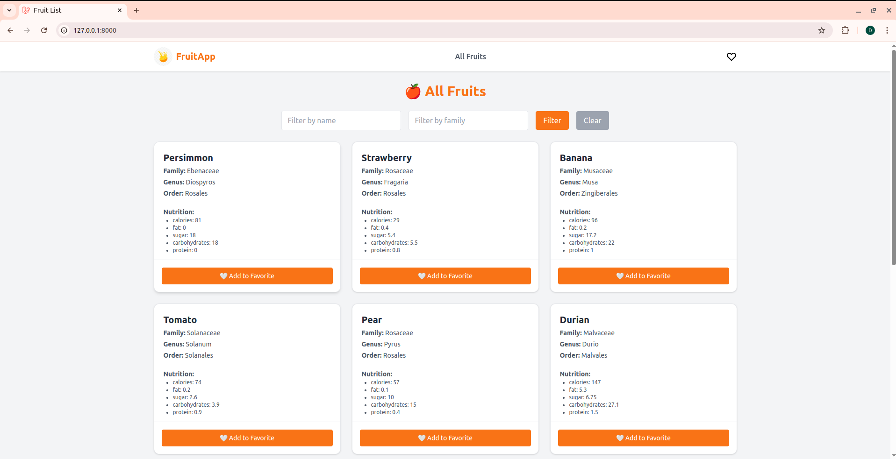
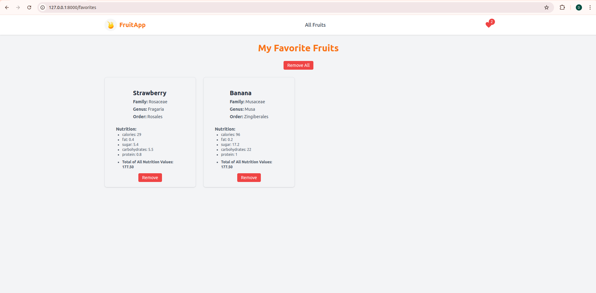

# 🍓 Fruits Test Task

This project is a full-stack fruit management application built with **Laravel (PHP)** for the backend and **ReactJS** for the frontend. It fetches fruit data from an external API and allows users to view, filter, and favorite fruits. Nutrition facts of favorites are also aggregated and displayed.

---

##  Features

- Console command to fetch all fruits from [FruityVice API](https://fruityvice.com/)
- Store data in a local MySQL/PostgreSQL database
- Send email notification upon successful data import
- Paginated fruits list with filter options (name & family)
- Add up to 10 fruits to favorites
- View all favorite fruits with total nutrition values
- ReactJS frontend (scaffolded with `laravel/ui`)
- Fully Dockerized setup
- Follows **PSR-12** coding standard (PHP) and **JavaScript Standard Style**

---

## Fetch Fruits & Send Email Notification

Use the following command:
```bash
php artisan fruits:fetch
```

## Installation & Setup

```bash
### 1. Clone the Repository 

git clone https://github.com/your-username/fruits-test-task.git
cd fruits-test-task

### 1. Copy the Environment File

cp .env.example .env

### 3. Build and Start Docker Containers

docker-compose up -d --build

### 4. Run Migrations 

docker exec -it your_app_container_name php artisan migrate

### 5. Access the Application

App URL: http://localhost:8000

### 6. Stop all containers:

docker-compose down

### 7. Setup Frontend(React)

npm install
npm run build
```
---
##  ScreenShot




